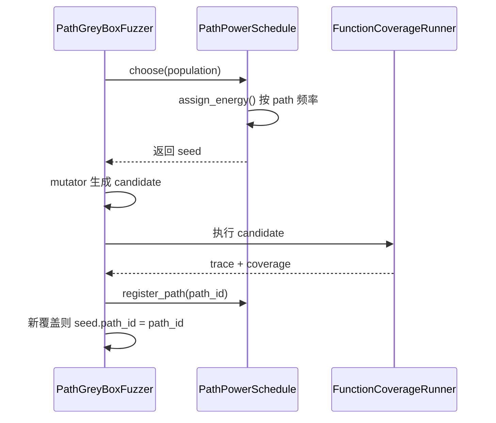

# Part B — 路径频率调度实现（任务二）

## 一、任务目标

完善 `schedule/path_power_schedule.py` 与 `fuzzer/path_grey_box_fuzzer.py`，实现基于**路径频率**的 seed 调度逻辑：路径被命中次数越多，对应 seed 获得的 fuzz 能量越低；罕见路径上的 seed 应被更频繁地选中继续变异。

## 二、调度在 fuzzing 循环中的位置

```
初始 corpus 顺序执行
        ↓
发现新覆盖 → 加入 population
        ↓
PathPowerSchedule.choose()  ← 按 energy 加权随机选 seed
        ↓
Mutator 叠变异 → 新 candidate
        ↓
Runner 执行 → PathGreyBoxFuzzer 更新 path 频率
        ↓
循环
```

与 Part A 的分工：**调度器决定「变异谁」，变异器决定「怎么变」，路径频率决定「谁更值得继续变」**。

## 三、设计思路

### 3.1 什么是 Path（路径）？

覆盖率模块记录两类信息：

| 概念 | 含义 | API |
|------|------|-----|
| **Trace** | 按时间顺序走过的 `(函数名, 行号)` 序列 | `Coverage.trace()` |
| **Coverage** | 执行触达的行集合 | `Coverage.coverage()` |

本实现采用 **AFL 风格的边序列（edge-based）** 标识路径：将 trace 中相邻两行 `(prev, curr)` 组成边序列再哈希。相比「整段 trace 哈希」，边序列对早退/路径长度差异更鲁棒；相比「coverage 集合」，边序列能区分「同样覆盖不同顺序」的执行。

```python
# utils/coverage.py
def path_id_from_trace(trace: List[Location]) -> str:
    edges = tuple(zip(trace, trace[1:]))
    return hashlib.md5(repr(edges).encode()).hexdigest()
```

### 3.2 能量公式

路径频率记为 `freq(path_id)`，seed 的能量为：

\[
\text{energy}(seed) = \frac{1}{\text{freq}(seed.path\_id)^{\text{exponent}}}
\]

默认 `exponent = 2.0`（指数反比，符合实验说明中 *exponential energy inversely proportional to path frequency* 的要求）。

| 路径频率 | energy（exponent=2） | 含义 |
|----------|----------------------|------|
| 1（新路径） | 1.0 | 最高优先级 |
| 2 | 0.25 | 已被探索两次，能量降为 1/4 |
| 10 | 0.01 | 高频路径，几乎不再优先变异 |

父类 `PowerSchedule.choose()` 将 energy 归一化后，用 `random.choices(..., weights=...)` 加权随机选择 seed。

## 四、改动文件与职责

### 4.1 `utils/coverage.py` — 路径标识

| 函数 | 作用 |
|------|------|
| `path_id_from_trace()` | 从执行 trace 计算 edge-based path_id |
| `path_id_from_coverage()` | 无 trace 时的 fallback |

### 4.2 `utils/seed.py` — seed 携带 path_id

```python
class Seed:
    def __init__(self, data, _coverage, path_id=""):
        self.path_id = path_id or path_id_from_coverage(_coverage)
```

新 seed 入 population 时，`PathGreyBoxFuzzer` 会写入其发现路径的真实 `path_id`。

### 4.3 `runner/function_coverage_runner.py` — 暴露 trace

每次执行后保存 `cov.trace()`，提供 `trace()` 方法供 fuzzer 计算 path_id。

### 4.4 `schedule/path_power_schedule.py` — 调度核心

| 方法 | 作用 |
|------|------|
| `register_path(path_id)` | 记录一次路径执行，返回是否为新路径 |
| `path_freq(path_id)` | 查询频率（下限为 1，避免除零） |
| `assign_energy(population)` | 按频率反比分配 energy |

```python
def assign_energy(self, population):
    for seed in population:
        freq = self.path_freq(seed.path_id)
        seed.energy = 1.0 / (freq ** self.exponent)
```

### 4.5 `fuzzer/path_grey_box_fuzzer.py` — 频率反馈闭环

每次 `run()` 后：

1. 调用 `super().run()` 完成执行、更新 population
2. 从 `runner.trace()` 计算 `path_id`
3. 调用 `schedule.register_path(path_id)` 更新频率
4. 若为新路径，更新 `last_new_path_time`
5. 更新 `total_paths = len(schedule.path_frequency)`
6. 若本次有新 seed 加入 population，为其设置 `path_id`

状态表新增两列：**Last New Path**、**Total Paths**，便于观察调度是否生效。

## 五、与基础调度 `PowerSchedule` 的对比

| 维度 | `PowerSchedule`（均匀） | `PathPowerSchedule`（路径频率） |
|------|-------------------------|--------------------------------|
| energy 分配 | 所有 seed = 1 | 与 path 频率成反比 |
| 反馈信号 | 无 | 每次执行的 trace → path 频率 |
| 适用场景 | 基线对比 | 优先探索罕见路径 |
| 入口 | `GreyBoxFuzzer` | `PathGreyBoxFuzzer`（`main.py` 默认） |

## 六、协作时序



## 七、测试验证

### 7.1 单元测试（逻辑正确性）

```python
schedule = PathPowerSchedule(exponent=2.0)
schedule.register_path("a")  # freq=1
schedule.register_path("a")  # freq=2

seeds = [Seed("x", set(), path_id="a"), Seed("y", set(), path_id="b")]
schedule.assign_energy(seeds)
# seeds[0].energy == 0.25  (1/2²)
# seeds[1].energy == 1.0   (未见过的 path，freq 视为 1)
```

### 7.2 集成测试（`main.py`）

```bash
uv run main.py --sample 4 --run-time 60
```

观察状态表中 `Total Paths` 随时间增长，`Last New Path` 在新路径发现时更新。

### 7.3 四 sample 覆盖率（30s，配合 Part A 变异）

| Sample | 覆盖率 | 结果 |
|--------|--------|------|
| 1 | 80.0%（8/10） | 达标 |
| 2 | 50.0%（8/16） | 达标（Part A 结构感知变异辅助） |
| 3 | 40–70% | 有随机波动，单独跑通常 ≥50% |
| 4 | 66.7%（2/3） | 达标 |

自检脚本：

```bash
python scripts/rubric_check.py
```

## 八、报告撰写要点

1. **路径如何定义**：edge-based trace hash，而非简单 coverage 集合
2. **频率如何统计**：`register_path()` 在每次执行后调用，不限于新覆盖
3. **energy 如何影响选择**：归一化后加权随机，`choose()` 继承自 `PowerSchedule`
4. **与均匀调度对比**：可从「罕见 path 的 seed 被选中次数」「覆盖率增长速度」等角度说明优势
5. **状态表截图**：展示 `Total Paths`、`Last New Path` 随运行变化

## 九、后续可改进方向

- 将 `exponent` 暴露为 `main.py` 命令行参数，便于对比实验
- 结合 Part A 的结构感知变异，针对 Sample 3 等格式约束样本做类似优化
- 与任务三的新调度策略（Size-Based / Coverage-Size / Rare-Line）做横向对比实验
