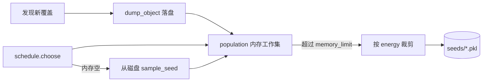

# Part D — Seed 持久化与内存控制（任务四）

## 一、任务目标

使用 `object_utils` 将运行过程中发现的 **seed** 及相关中间结果持久化到文件系统，避免长时间 fuzz 时 `population` 无限增长导致内存占用持续上升。

## 二、问题背景

原始实现中，所有发现新覆盖的 seed 都保存在 `GreyBoxFuzzer.population` 列表里。`PowerSchedule.choose()` 虽在超过 1000 个 seed 时删除 energy 最低项，但：

- 1000 个 seed 对象（含 coverage 集合、可能很长的 `data`）仍占用大量内存
- 进程异常退出时，内存中的 seed 全部丢失
- 崩溃输入仅保存在 `crash_map` 字典中，未落盘

## 三、设计思路

采用 **「即时落盘 + 内存工作集」** 策略：

1. 每个新 seed **立即**序列化到磁盘（去重）
2. 内存中只保留 energy 较高的前 `memory_limit` 个 seed 供调度变异
3. 内存工作集被裁剪后，可从磁盘 **随机回放** seed 继续 fuzz
4. 唯一崩溃输入写入 `crashes/` 子目录
5. 运行结束写入 `manifest.pkl` 汇总索引



## 四、实现文件

### 4.1 `utils/seed_store.py` — SeedPersistence

| 方法 | 作用 |
|------|------|
| `persist_seed(seed)` | 按 `(data, coverage)` 指纹去重后落盘 |
| `persist_crash(inp, crash_id)` | 保存唯一崩溃输入 |
| `sample_seed()` | 从磁盘随机加载一个 seed（内存空时回放） |
| `persist_manifest()` | 写入 seed/crash 索引统计 |
| `stats()` | 返回 `(seed 数, crash 数)` |

指纹计算复用 `object_utils.get_md5_of_object()`，文件名 `{md5}.pkl`。

目录结构：

```text
_result/seeds-Sample-2-path/
├── manifest.pkl
├── {hash1}.pkl
├── {hash2}.pkl
└── crashes/
    └── {crash_hash}.pkl
```

### 4.2 `fuzzer/grey_box_fuzzer.py` — 接入点

| 钩子 | 行为 |
|------|------|
| `__init__(seed_dir, memory_limit)` | 创建 `SeedPersistence` |
| `_add_seed()` | 落盘 + 加入 population + 裁剪内存 |
| `_trim_memory_population()` | 按 schedule energy 保留 top-K |
| `create_candidate()` | population 空时从磁盘回放 |
| `run()` 崩溃分支 | `persist_crash()` |

### 4.3 `main.py` — 入口参数

```bash
uv run main.py --sample 2 --run-time 60 --memory-limit 200
```

| 参数 | 默认 | 说明 |
|------|------|------|
| `--output-dir` | `_result` | 结果根目录 |
| `--memory-limit` | `200` | 内存中最多保留的 seed 数 |

seed 目录自动生成：`_result/seeds-Sample-{N}-{schedule}/`

运行结束输出示例：

```text
Persisted seeds: 42, persisted crashes: 3, dir: _result/seeds-Sample-2-path
```

## 五、内存控制逻辑

```python
def _trim_memory_population(self):
    if len(self.population) <= self.seed_store.memory_limit:
        return
    self.schedule.assign_energy(self.population)
    self.population.sort(key=lambda s: s.energy, reverse=True)
    self.population = self.population[: self.seed_store.memory_limit]
```

- 被裁剪的 seed **仍保留在磁盘**，不丢失
- 调度器下次 `choose()` 只在内存工作集中选择；若工作集被 `PowerSchedule` 删至空，则从磁盘 `sample_seed()` 恢复

## 六、与 object_utils 的关系

| 工具函数 | 用途 |
|----------|------|
| `dump_object()` | 写 seed / crash / manifest（自动创建父目录） |
| `load_object()` | 回放 seed、读取 manifest |
| `get_md5_of_object()` | 生成去重指纹与文件名 |

`SeedPersistence` 是对这三个函数的面向业务封装，fuzzer 不直接操作 pickle。

## 七、测试验证

### 7.1 功能测试

```bash
uv run main.py --sample 2 --run-time 30 --quiet
```

检查：

- `_result/seeds-Sample-2-path/` 下出现多个 `{hash}.pkl`
- `manifest.pkl` 中 `total_seeds` 与文件数一致
- 若有崩溃，`crashes/` 子目录非空

### 7.2 自检脚本

```bash
python scripts/rubric_check.py
```

「框架完善 / seed 持久化」项应显示 **PASS**。

### 7.3 内存行为（报告可写）

对比 `--memory-limit 50` 与 `--memory-limit 500` 长跑时：

- `len(fuzzer.population)` 始终 ≤ `memory_limit`
- 磁盘 seed 数可大于内存工作集

## 八、报告撰写要点

1. 为何需要持久化：population 增长与内存风险  
2. 工作集 + 落盘的分工  
3. 目录结构与 manifest 含义  
4. `--memory-limit` 对性能/覆盖率的影响（如有实测）  
5. 截图：seed 目录、`Persisted seeds:` 终端输出
